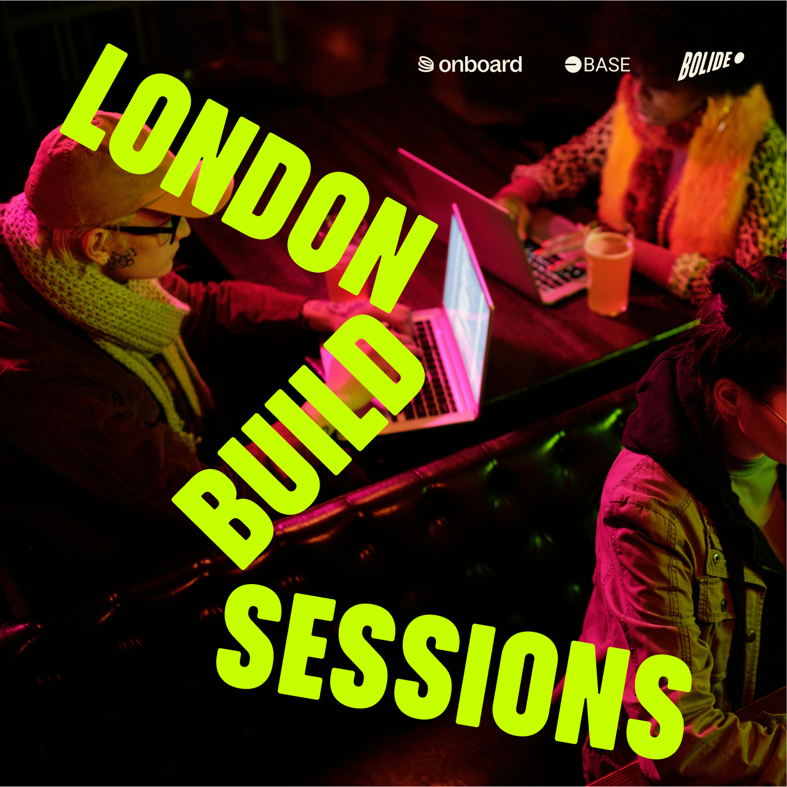
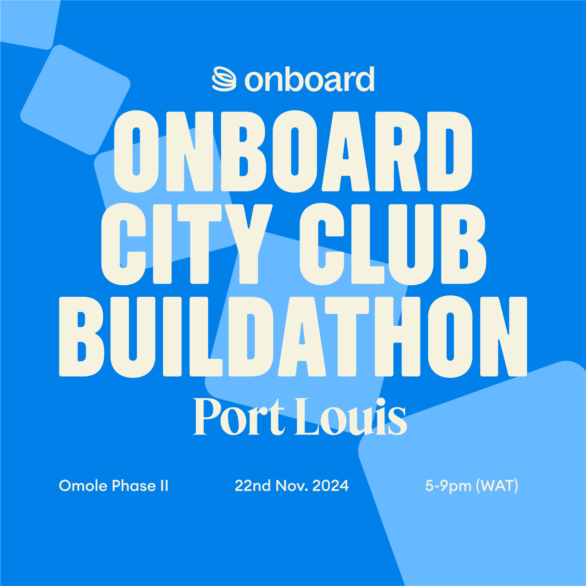
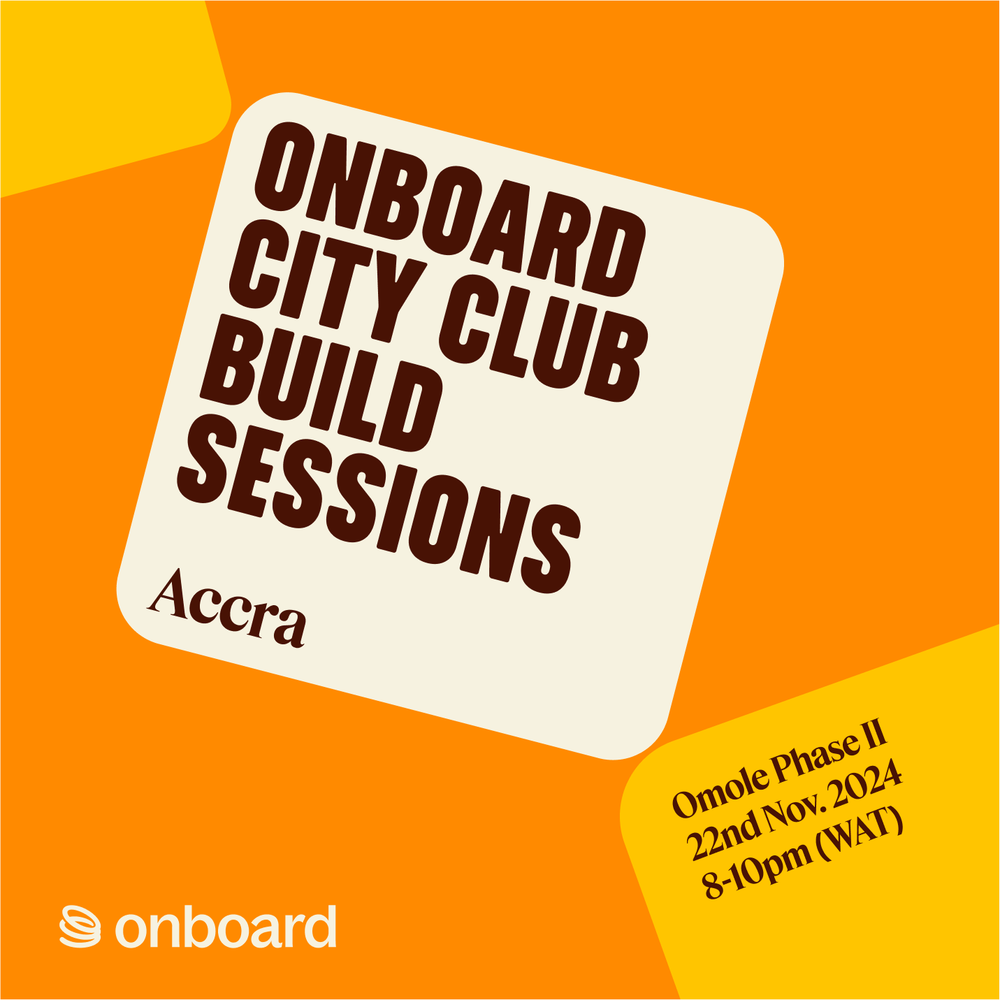
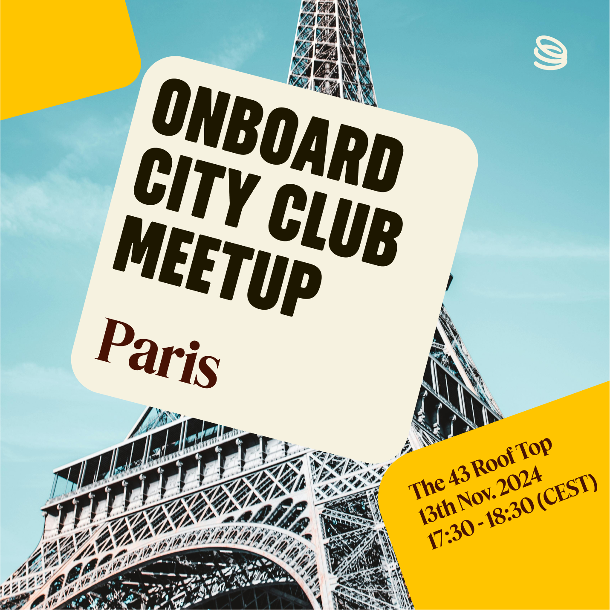
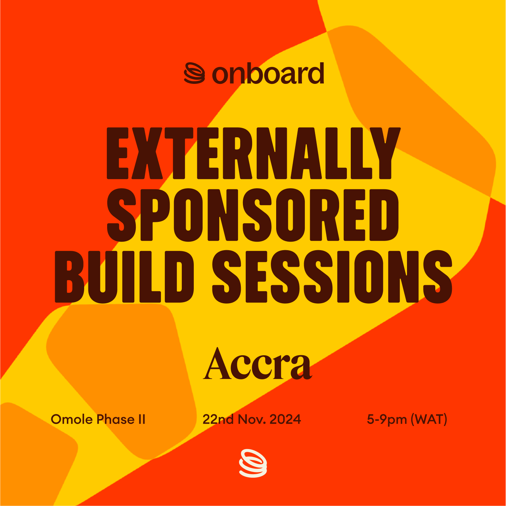
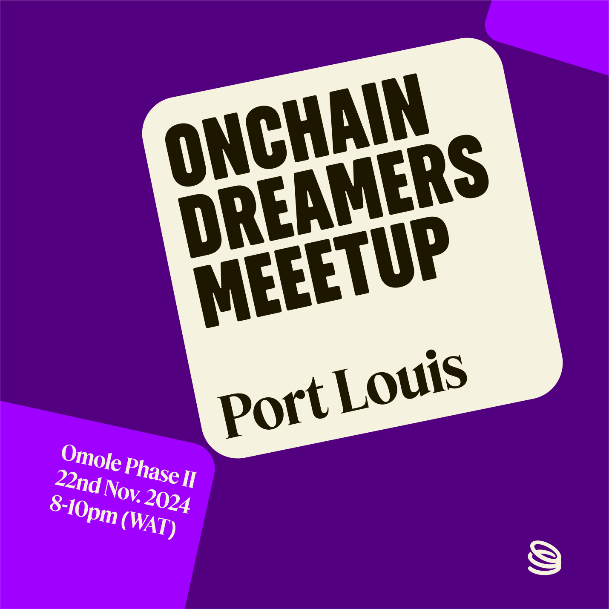

# Onboard Event Template Guide

## Introduction
This guide will help you create and use event templates for Onboard events. After submitting your event request via [the form](https://tally.so/r/nPlZ2d), you can use our Figma template to customize event details and create promotional materials for social media and event displays.

## Getting Started

1. Access the Figma template: [Dreamer Event Template](https://www.figma.com/design/ylaaklxz6RUlambJQYJMFB/Dreamer-Event-Template?node-id=0-1&node-type=canvas&t=froCT4x8OKoAKcti-0)
2. Copy the Figma template to your drafts before making any changes.

## Using the Template

1. Open your copied Figma draft.
2. Navigate to the specific event type you're organizing (e.g., Build Sessions, Buildathon, City Build Session).
3. Update the following details:
   - Event title
   - Date and time
   - Location
   - Any other specific event information
4. Customize colors, fonts, and imagery as needed, while staying within Onboard's brand guidelines.
5. Export your designs in appropriate formats for different platforms (e.g., PNG for social media, PDF for print).

## Event Types and Their Uses

1. **Build Sessions**: Use for collaborative coding events or workshops.
2. **Buildathon**: Perfect for longer, intensive building events or hackathons.
3. **City Build Session**: Ideal for local, city-specific building events.
4. **City Club Meetup**: Use for casual, networking-focused gatherings in specific cities.
5. **Ext Build Session**: Suitable for extended or advanced building sessions.
6. **OD Meetup**: Use for general Onboard Dreamer meetups and community gatherings.

## Best Practices

1. Maintain consistent branding across all event materials.
2. Ensure all text is legible and important information stands out.
3. Use high-quality images that represent the event type and Onboard's vision.
4. Create variations for different social media platforms (e.g., square for Instagram, landscape for Twitter).

## Promoting Your Event

1. Share your customized graphics on social media platforms.
2. Use the templates to create email banners for event invitations.
3. Print large-format versions for use as backdrops or banners at the event venue.

## During the Event

1. Display the event graphics on screens or projectors.
2. Use the templates to create name tags, agenda handouts, or other event materials.

Remember, these templates are designed to make your event planning easier while maintaining a consistent brand image across all Onboard events. Feel free to get creative within the guidelines!

Here's few of the available event templates:

<table>
  <tr>
    <td width="50%">
      <strong>1. Build Sessions</strong> 
      
    </td>
    <td width="50%">
      <strong>2. Buildathon</strong> 
      
    </td>
  </tr>
  <tr>
    <td width="50%">
      <strong>3. City Build Session</strong> 
      
    </td>
    <td width="50%">
      <strong>4. City Club Meetup</strong> 
      
    </td>
  </tr>
  <tr>
    <td width="50%">
      <strong>5. Ext Build Session</strong> 
      
    </td>
    <td width="50%">
      <strong>6. OD Meetup</strong> 
      
    </td>
  </tr>
</table>